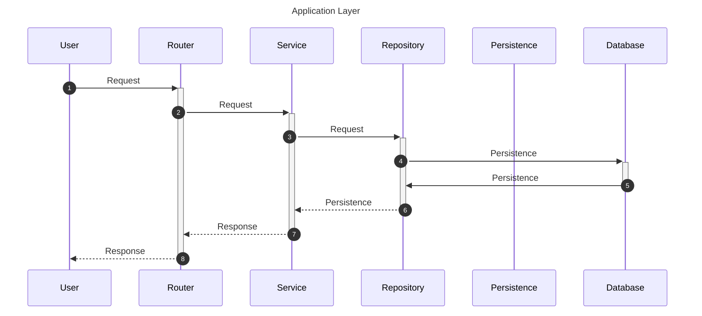
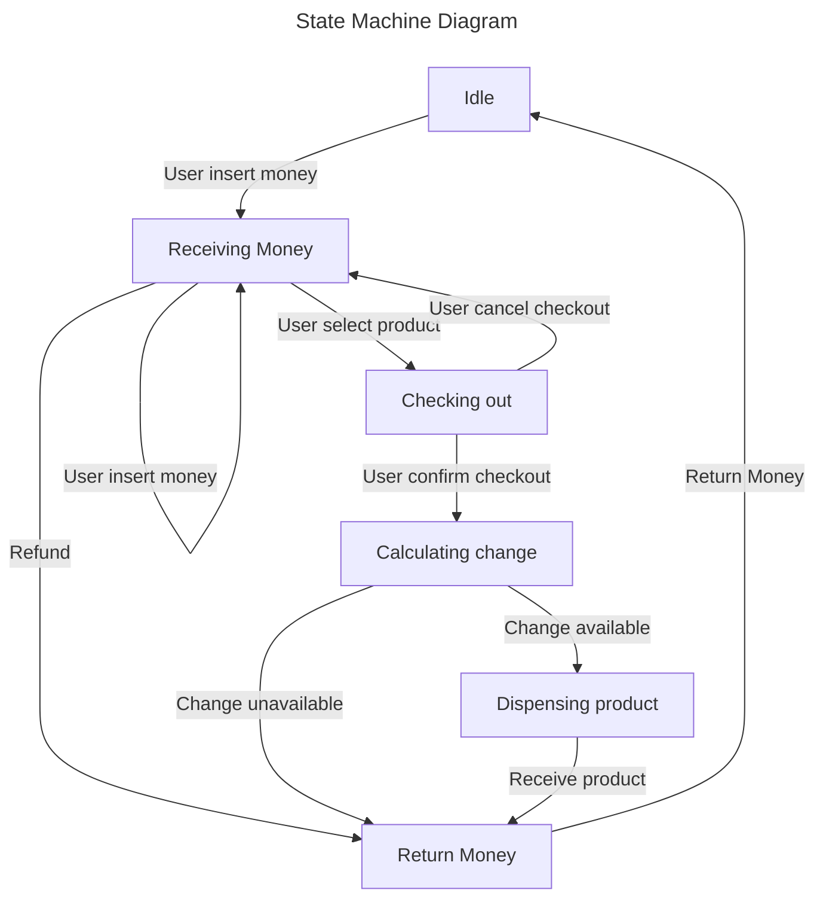

## How to
#### run project

run `docker compose up --build`

| project  | port |
| -------- | ---- |
| frontend | 3000 |
| backend  | 8080 |
| postgres | 5432 |

#### run test
run `make run-test` in *./be* folder

### Maintenance Mode
#### User login
`username: admin` \
\
`password: 1q2w3e4r5t`

## Database schema

Table `user`

| column | type |
| -------- | ------------- |
| user_id | Bigserial, PK |
| username | Text |
| password | Text |

\
Table `product`

| column | type |
| ---------- | -------- |
| product_id | Text, PK |
| name | Text |
| image | Text |
| stock | Int8 |
| price | Int8 |

\
Table `reserved_money`

| column | type |
| -------- | ---- |
| coins1 | Int8 |
| coins5 | Int8 |
| coins10 | Int8 |
| bank20 | Int8 |
| bank50 | Int8 |
| bank100 | Int8 |
| bank500 | Int8 |
| bank1000 | Int8 |

## Project Structure
https://plugins.jetbrains.com/plugin/20146-mermaid

### Frontend

```
project
│  
└──package.json  
│
└───app
    │
    └───app.tsx  
    │
    └───pages
    │   │   
    │   └───page
    │       │
    │       └───page.tsx
    │
    └───components
    │   │   
    │   └───component
    │       │
    │       └───component.tsx
    └───hooks
    │   │   
    │   └───hook
    │       │
    │       └───hook.tsx
    └───service
    │   │   
    │   └───service.tsx
    │  
    │
    └───types
    │   │ 
    │   └───types.type.tsx
    │
    └───utils
        │   
        └───util
            │
            └───util.tsx    
```

### Backend

- **Router:** APIs
- **Service:** Business logic
- **Repository:** Query Database
- **Persistence:** Database schema
- **Database:** Data Storage




